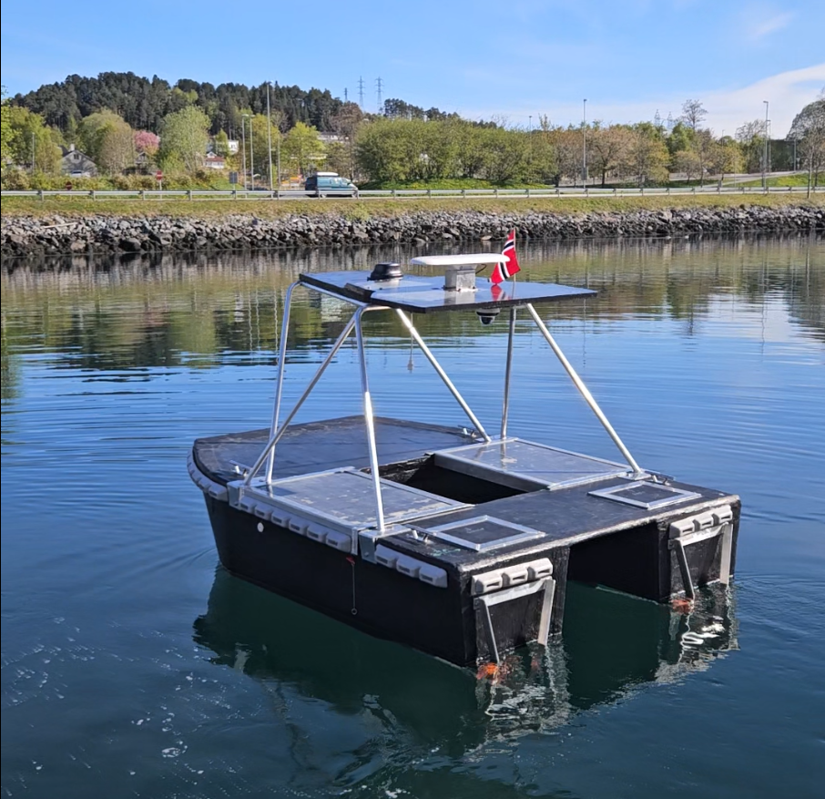
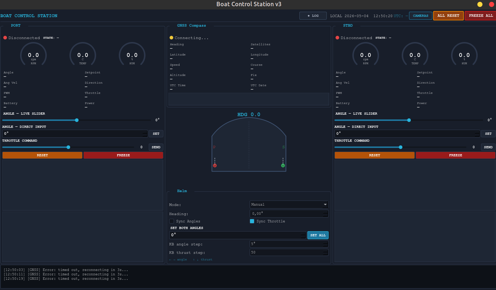
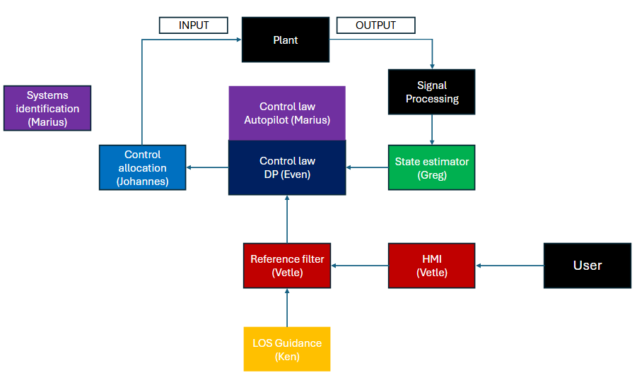
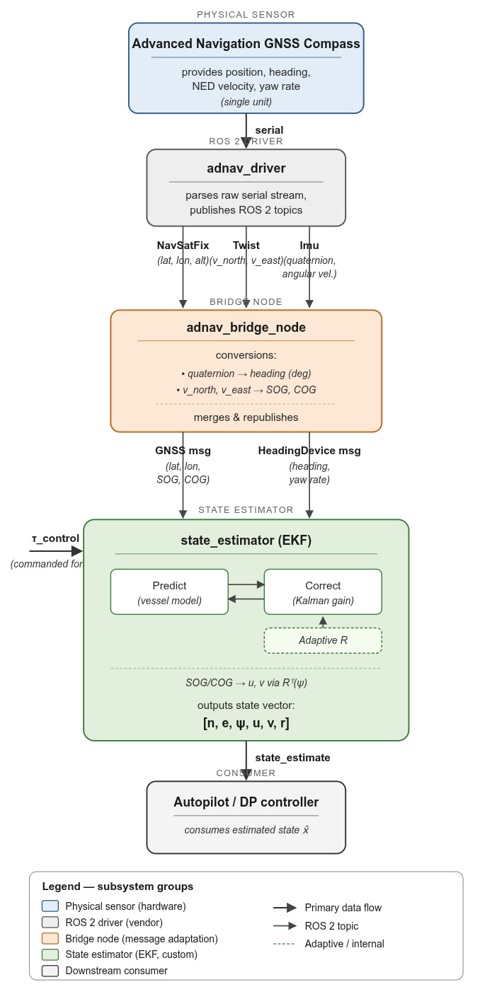
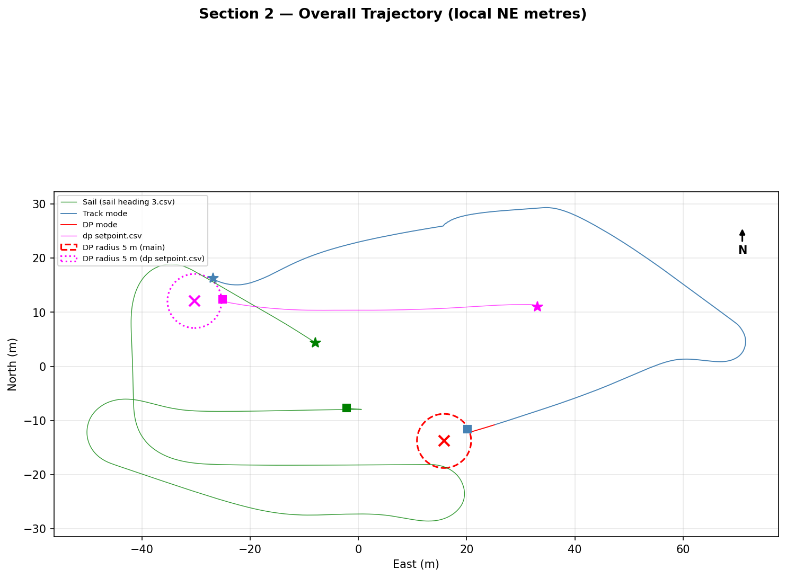
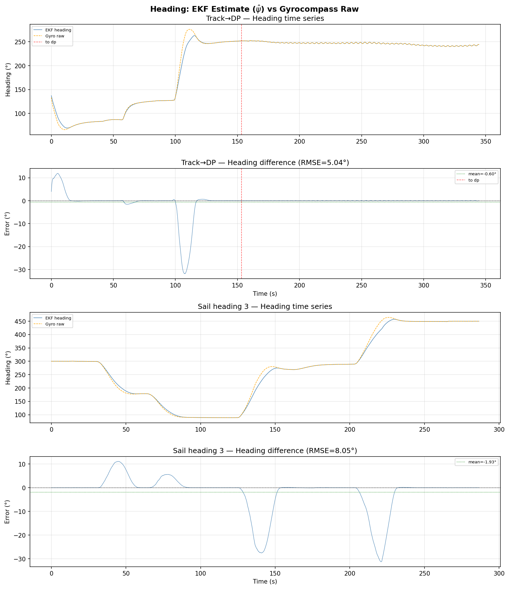
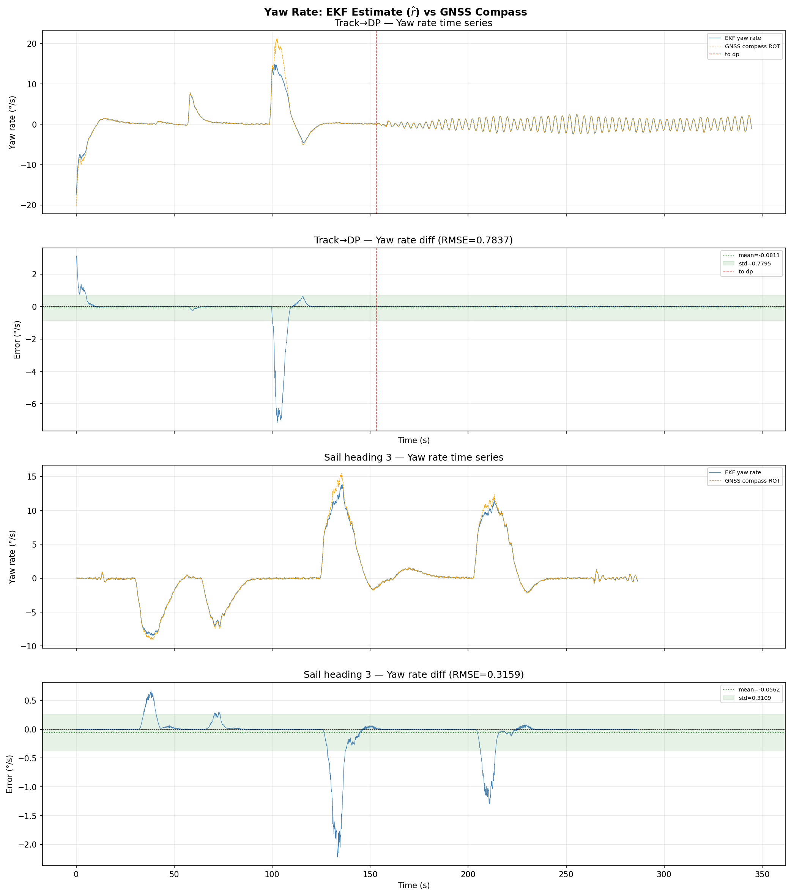
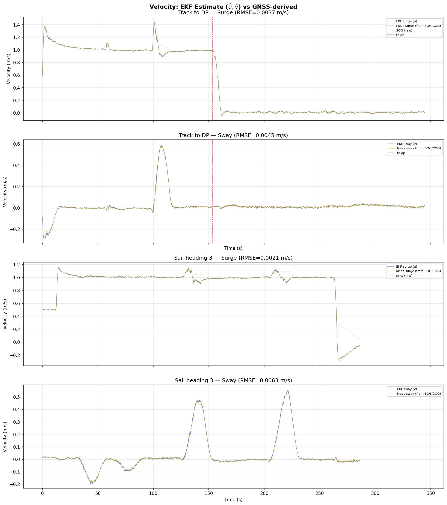
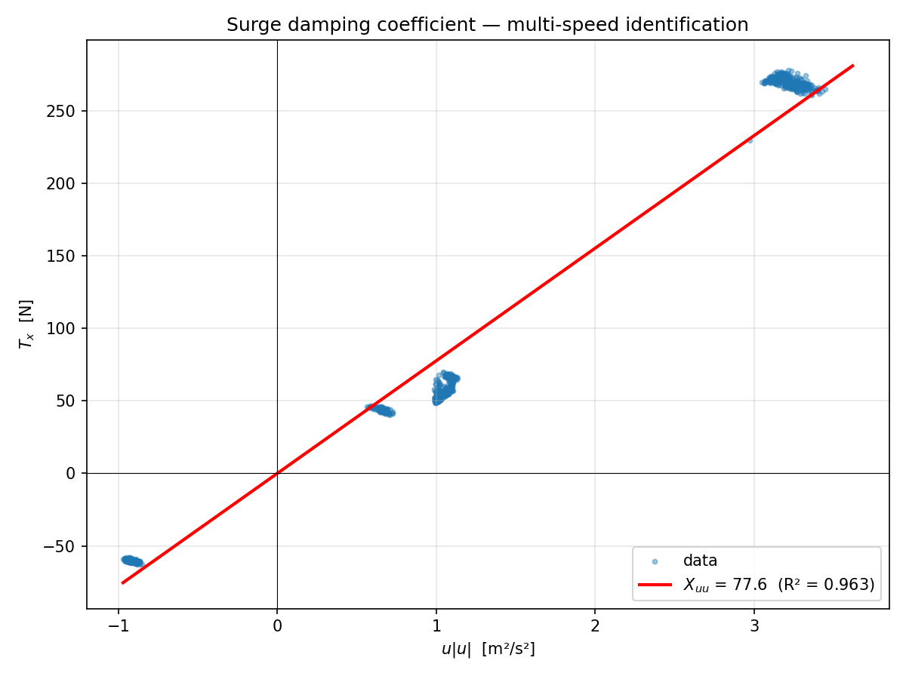
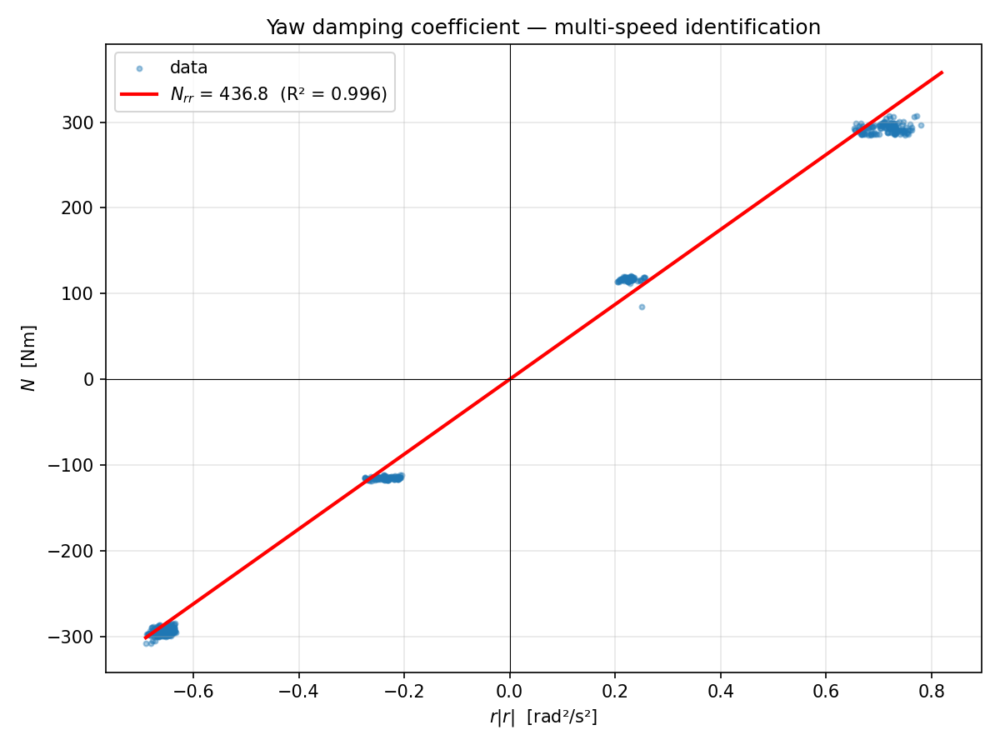

# USV State Estimation

State estimation and sensor integration for a ROS 2 autonomous surface vessel, developed as part of the GIGA Project at NTNU Ålesund (MMA4007, Applied AI and Control).

<p align="center">
  
</p>

## Problem

The GIGA vessel is a 450 kg autonomous surface vessel equipped with an Advanced Navigation GNSS Compass (dual-antenna GNSS/INS). Raw GNSS position and gyrocompass heading are noisy and arrive at discrete time steps. Downstream modules in the GNC pipeline, including the autopilot, DP controller, LOS guidance, and thrust allocator, require a smooth, continuous state estimate at 10 Hz. Feeding raw sensor data directly to the controllers causes excessive thruster reactions to measurement noise, leading to unnecessary power consumption and actuator wear.

The state estimator sits between the sensors and the control law, fusing noisy measurements with a mathematical model of the vessel dynamics to produce a filtered 6-DOF state: position, heading, surge and sway velocity, and yaw rate.

During the early stages of the project, the vessel's Human-Machine Interface (HMI) was also developed as part of this work and used during the initial sea trials.

<p align="center">
  
</p>

*Boat Control Station v3.*

## Architecture

<p align="center">
  
</p>

*Control system architecture. State estimator highlighted in green.*

## Data flow

The complete signal path from the physical sensor through the bridge node and EKF to the downstream controllers:

<p align="center">
  
</p>

*State estimator data flow.*

The system has two main components:

### Extended Kalman Filter (`state_estimator/ekf_node.py`)

- **State vector**: `[north, east, heading, surge vel, sway vel, yaw rate]`
- **Process model**: 3-DOF vessel dynamics with nonlinear quadratic damping, propagated through the inverse mass matrix
- **Jacobian**: analytically derived linearization of the kinematic and dynamic equations, including damping derivatives
- **Adaptive R**: measurement noise covariance estimated online from a rolling variance buffer (100 samples / 10 s window), with per-channel floors based on GNSS hardware specs to prevent overconfidence
- **Sensor dropout handling**: prediction runs independently of sensor availability. Correction is applied per-channel via a masked observation matrix
- **Config-driven**: Q, R, and adaptive toggle loaded from YAML, tunable at runtime via ROS 2 topic

### GNSS Bridge (`gnss_bridge/adnav_bridge_node.py`)

Translates raw output from the Advanced Navigation INS/GNSS driver into the ROS 2 message interface used by the rest of the control system:

- `NavSatFix` → latitude, longitude, altitude
- `Twist` → SOG/COG decomposition into speed over ground and course
- `IMU` → quaternion-to-heading conversion (NED frame), yaw rate extraction
- Sensor health and signal validity monitoring

## Sea trial results

The EKF ran at 10 Hz on the vessel's onboard computer during sea trials in Nørvasundet, Ålesund (May 2026). Sea trial time was limited due to weather, equipment issues, and shared vessel access across the team. The final tuning session (May 11) provided calm conditions and three usable datasets: a track-to-DP transition run (345 s), a sail mode run with heading changes (287 s), and a DP station-keeping run (60 s).

### Trajectory

<p align="center">
  
</p>

*Overall NE trajectory for all sea trial datasets.*

### Heading estimation

<p align="center">
  
</p>

*EKF heading vs gyrocompass raw. RMSE: 5.04° (track-to-DP), 8.05° (sail heading 3).*

### Yaw rate estimation

<p align="center">
  
</p>

*EKF yaw rate vs GNSS compass rate of turn. RMSE: 0.78°/s (track-to-DP), 0.32°/s (sail heading 3).*

### Velocity estimation

<p align="center">
  
</p>

*EKF surge and sway vs GNSS-derived body-frame velocities. RMSE below 0.01 m/s.*

### Pass-through behavior

The adaptive R mechanism drives measurement noise estimates down to R_min within the first 10 seconds, producing Kalman gains close to 1.0 (K ≈ 0.98) for position, surge, sway, and yaw rate. The filter effectively passes the measurement through with minimal smoothing on 5 of 6 channels. Only heading sees genuine model-based filtering (K_ψ ≈ 0.24).

### Innovation statistics (track-to-DP dataset)

| State | Mean | Std | RMSE | % within ±2σ |
|---|---|---|---|---|
| North (m) | 0.00004 | 0.00027 | 0.00027 | 100.0 |
| East (m) | 0.00001 | 0.00004 | 0.00004 | 100.0 |
| Heading (°) | 0.598 | 5.005 | 5.040 | 47.6 |
| Surge (m/s) | 0.00079 | 0.00366 | 0.00375 | 100.0 |
| Sway (m/s) | -0.00042 | 0.00448 | 0.00449 | 100.0 |
| Yaw rate (°/s) | 0.081 | 0.780 | 0.784 | 92.7 |

### DP station-keeping performance (191 s segment)

| Metric | Mean | Std | Max |
|---|---|---|---|
| Position error (m) | -0.05 | 0.47 | 4.71 |
| Heading error (°) | -0.24 | 0.78 | 2.11 |

The full control stack (autopilot, LOS guidance, DP controller, thrust allocator) ran using only EKF output.

### Limitations and ongoing work

Sea trial time was constrained by weather windows, hardware debugging (blown fuses, communication issues), and shared scheduling across the team. Only three clean datasets were collected from the final tuning session. The EKF was tuned and validated under calm conditions in Nørvasundet; performance in rougher sea states remains untested.

The project continues into next year with planned improvements including testing under more varied sea conditions and exploring UKF or nonlinear observer alternatives for improved robustness during aggressive manoeuvres.

## Hydrodynamic parameter identification

A basic parameter identification procedure was carried out during the sea trials. Steady-state thrust balance (`T = D(v)`) at multiple speeds gives a least-squares fit for the quadratic damping coefficients used in the EKF process model.

The experiment planning was limited, resulting in only a few distinct speed setpoints and short steady-state windows. The identified values should be treated as rough estimates rather than precise coefficients. The primary goal was to go through the identification process and build familiarity with the methodology rather than produce definitive parameters.

| Coefficient | Value | R² | Description |
|---|---|---|---|
| X_uu | 77.6 N/(m/s)² | 0.963 | Surge damping |
| N_rr | 436.8 Nm/(rad/s)² | 0.996 | Yaw damping |

<p align="center">
  
  
</p>

## Repo structure

```
src/
  state_estimator/          
    state_estimator/
      ekf_node.py            # EKF implementation
    config/
      ekf_config.yaml        # Q, R, adaptive toggle
  gnss_bridge/              
    gnss_bridge/
      adnav_bridge_node.py   # Advanced Navigation → ROS 2 bridge
  interfaces/
    msg/
      StateEstimate.msg      # 6-DOF output: lat, lon, heading, u, v, r
      GNSS.msg               # Position + SOG/COG + health flags
      HeadingDevice.msg      # Heading + yaw rate + health flags
docs/
  images/                    # Plots and diagrams used in this README
```

## Report

The full project report covering system design, implementation, and sea trial results is available at [`docs/MMA4007_Project_Report.pdf`](docs/MMA4007_Project_Report.pdf).

Full project repo: [oivindkjerstad/MMA4007](https://github.com/oivindkjerstad/MMA4007)

## Built with

- **ROS 2 Humble** on Ubuntu 22.04
- **Python / NumPy** for the EKF and bridge nodes
- **Advanced Navigation Spatial** INS/GNSS unit
- **PlotJuggler** for real-time debugging during sea trials
